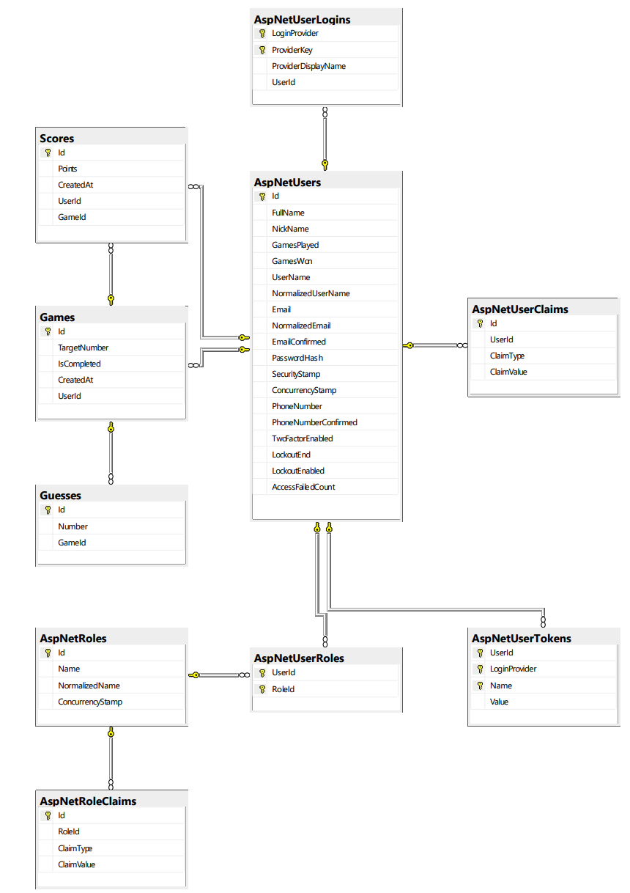

# SPA-multiplayer-game-in-the-browser
SPA - ASP.Net core react (Guessing game, profile status, historical highscore, Api, SingelR{notification})

SPA (Single Page Apps).Our team has builded a Authentication logging and has developed ASP.Net core React page. User may able to play a game with identifiying logging. User may leave middle of the game and play again from previous status. We will ask to user if u want start from previos game or want to start new game. Game page and profile status need a authentication. 

Client side only decoration of the page we have builded. All logic has been generated in server side. We had fetching data from server side.

## Structure of Project:
|   Tasks     |   Framwork    |  Effect  |
|-----|--------|-------|
|C# |  Rest API   | ASP.Net React
|React |  UseEffect, UseState, FetchData   | Fetching Data via Endpoints
|Tamplete | Entity Framework, React, LinQ | Controllers
|Database | SQL | Database Diagram below
|Model | VS C# & .NET Core 6   | Get and Post
|Authentication | ASP.NET Core 6 - 6.0.23  | Get and Post
|Connection |  JSON   |  Global Datbase

## Database diagram
The diagram includes automitacally generated authentication and authorization relations as well as our game database design and their relationships.

## Team

- [Md Ruhul Amin](https://github.com/Md-Ruhul-Amin-Rony)
- [Tasmia Zahin](https://github.com/tasmiazahin)
- [Reza](https://github.com/Rezaeskandar)
- [Md. Kamrul Hasan](https://github.com/chasmkhasan)
